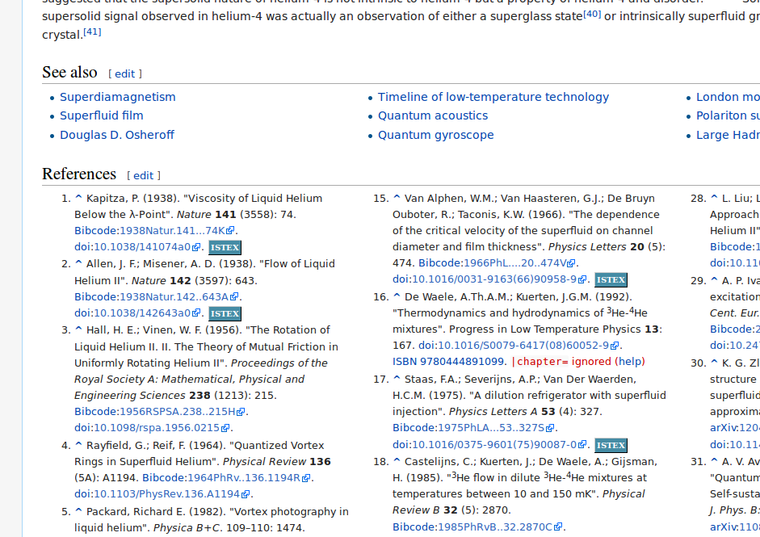
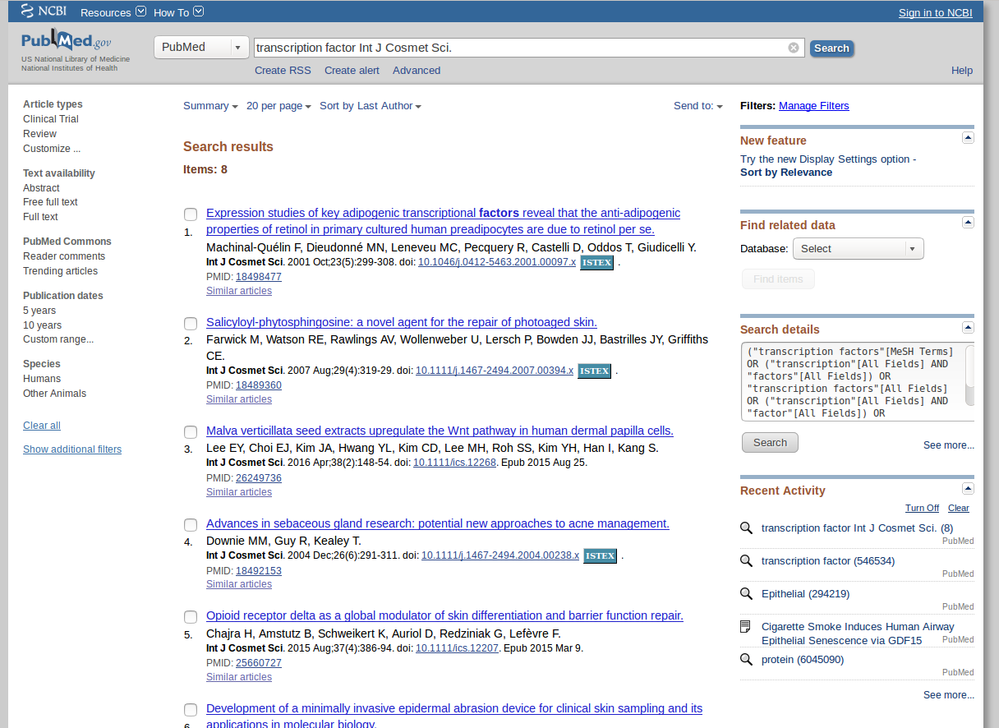
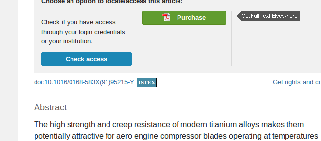

#ISTEX
A basic add-on for identifying dynamically ISTEX resources in the browser pages.

##Functionalities

This add-on performs the following tasks:

* Add an ISTEX button next to any DOI, OpenUrl and PMID found in the browser page in case the corresponding document is present in ISTEX, based on the ISTEX OpenURL service. Clicking on the ISTEX button will open a new tab with opening the corresponding PDF, assuming that the access to the ISTEX full-texts is authorized. 

* Propose a citation service when an ISTEX PDF is opened. When opening the ISTEX PDF, an add-on icon on the top menu bar is activated. Clicking on the icon will open a panel with the citation information corresponding to the publication. As the authoritative publisher's metadata are used (the MODS resource of the ISTEX API), the citation should be of very high quality. 

##Supported identifiers and protocols

Linking work at item level (e.g. article) and will try to identifying the following identifiers in the web page:

* OpenURL 1.0, including COInS - link resolver prefixes will be examined in case of SFX and Proquest 360 Link
* DOI
* PubMed ID (PMID)
* Publisher Item Identifier (PII)

##Supported browser

Currently: 

* Firefox

##Examples

